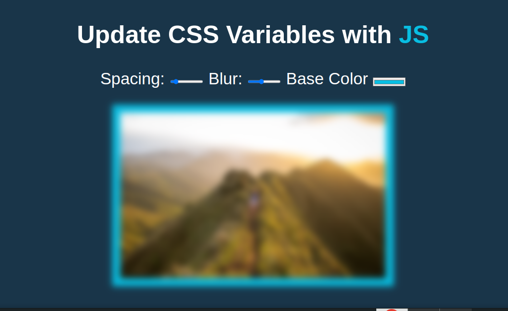
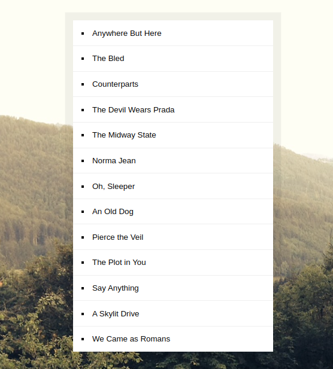

# JavaScript Mini Projects

A collection of mini JavaScript projects created for fun and learning purposes. Each project explores different aspects of web development and JavaScript. Check them out!

## Projects

1. **Adding Up Times with Reduce**

2. **Follow Along Link Highlighter**
   

3. **Mouse Move Shadow**
   

4. **Sticky Nav**

5. **Click and Drag**
   

6. **Fun with Canvas**
   .png)

7. **Multiple Checking with Shift**
   

8. **Stripe Follow Along Nav**
   

9. **Countdown Timer**
   

10. **Geolocation**

11. **Type Ahead**
    

12. **CSS Variables**
    

13. **JS Clock**
    

14. **Slide In On Scroll**

15. **Video Speed Controller**
    
    

16. **Custom Video Player**
    

17. **JS Drum Kit**
    

18. **Sort Without Articles**
    

19. **Webcam Fun**

20. **Dev Tools Domination**
    

21. **Key Sequence Detection**

22. **Speech Detection**
    

23. **Whack-a-Mole**
    

24. **Flex Panel Gallery**
    

25. **Local Storage**

26. **Speech Synthesis**
    

